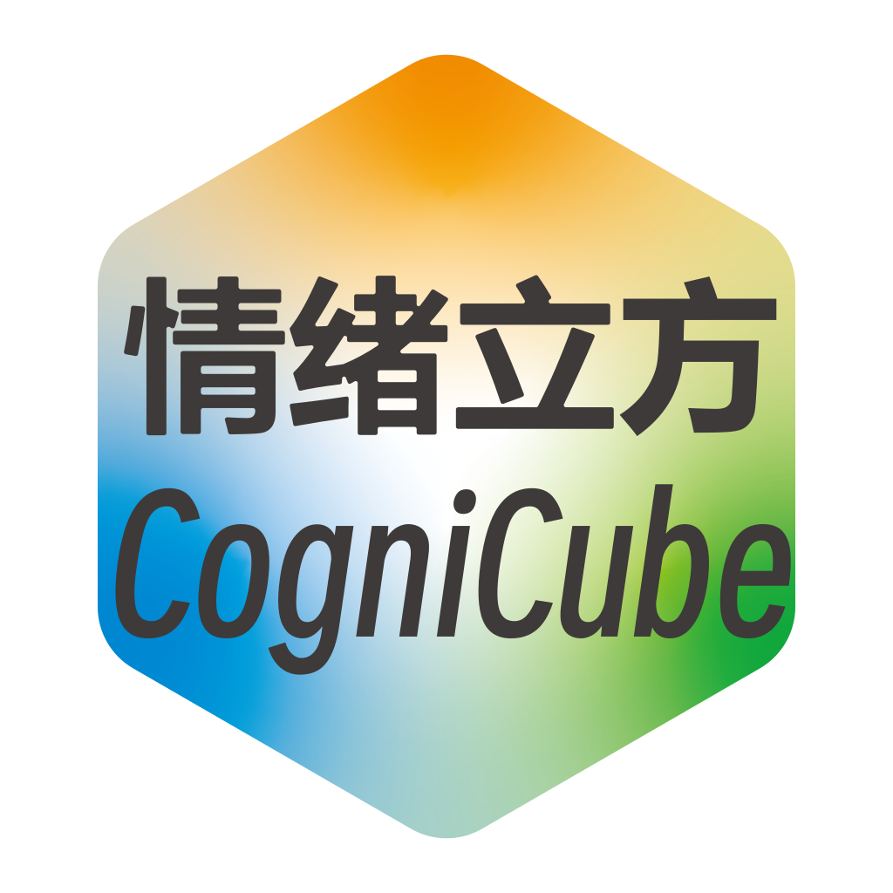
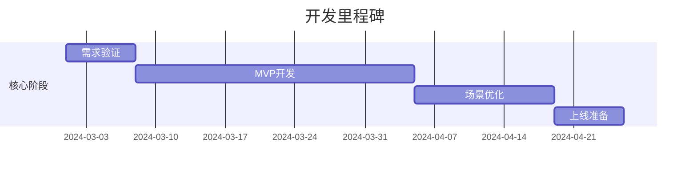
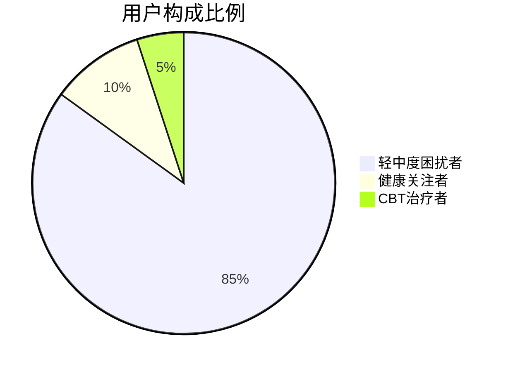
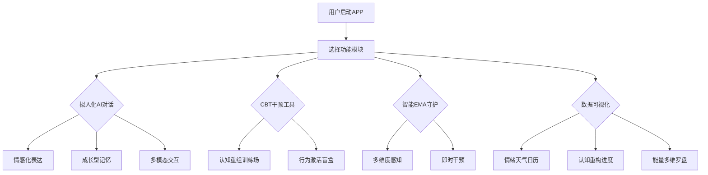
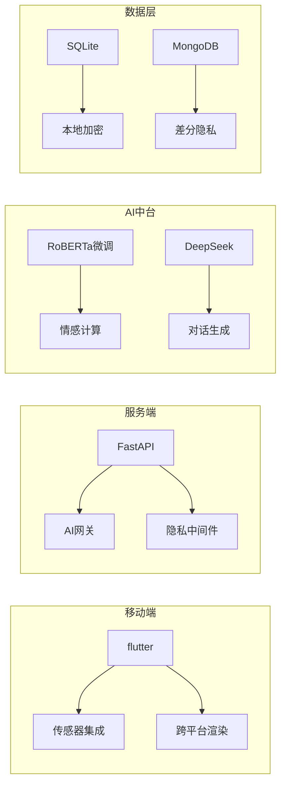

<div align="center">

  
</div>

# 情绪立方——基于CBT疗法与AI辅助心理健康APP

[点我前往使用文档](./docs/README.md)

## 一、概述<a id=" 一、概述"></a>

### 1.1 目录

- [情绪立方——基于CBT疗法与AI辅助心理健康APP](#情绪立方基于cbt疗法与ai辅助心理健康app)
  - [一、概述](#一概述)
    - [1.1 目录](#11-目录)
    - [1.2 功能模块描述](#12-功能模块描述)
    - [1.3 项目说明](#13-项目说明)
      - [1.3.1 人员安排](#131-人员安排)
      - [1.3.2 时间安排](#132-时间安排)
  - [二、需求分析](#二需求分析)
    - [2.1 场景分析](#21-场景分析)
    - [2.2 用户群体画像](#22-用户群体画像)
  - [三、亮点](#三亮点)
    - [3.1 特色应用](#31-特色应用)
      - [3.1.1 拟人化AI对话：有温度的数字解忧杂货铺](#311-拟人化ai对话有温度的数字解忧杂货铺)
      - [3.1.2 CBT干预工具箱：可玩化的CBT训练营](#312-cbt干预工具箱可玩化的cbt训练营)
      - [3.1.3 智能EMA守护系统：会预判的校园心理雷达](#313-智能ema守护系统会预判的校园心理雷达)
      - [3.1.4 数据可视化与反馈：会讲故事的情绪博物馆](#314-数据可视化与反馈会讲故事的情绪博物馆)
      - [3.1.5 隐私安全与防依赖机制：有原则的隐私守门人](#315-隐私安全与防依赖机制有原则的隐私守门人)
    - [3.2 市面应用对比](#32-市面应用对比)
  - [四、全局说明](#四全局说明)
    - [4.1 产品结构图](#41-产品结构图)
    - [4.2 产品流程图](#42-产品流程图)
  - [五、产品技术路线](#五产品技术路线)
    - [5.1 技术架构全景图](#51-技术架构全景图)
    - [5.2 前后端技术栈说明](#52-前后端技术栈说明)
      - [5.2.1 前端（Flutter版本）](#521-前端flutter版本)
      - [5.2.1 后端](#521-后端)
    - [5.3 其他技术栈](#53-其他技术栈)
    - [5.4 实验性代码展示](#54-实验性代码展示)
      - [5.4.1 隐私保护实现](#541-隐私保护实现)
  - [六、产品未来发展方向](#六产品未来发展方向)

### 1.2 功能模块描述

四大核心功能系统：

1. **拟人化AI对话系统**：具备情感化表达与成长型记忆的智能陪伴
2. **CBT干预工具箱**：包含认知重组训练场和行为激活盲盒的数字疗法
3. **智能EMA守护系统**：基于多维度感知的即时心理干预
4. **数据可视化中心**：情绪天气日历、认知重构进度等三维数据展示

### 1.3 项目说明

#### 1.3.1 人员安排

| 角色    | 职责范围        | 技术栈                           |
| ----- | ----------- | ----------------------------- |
| 前端开发  | 前端功能实现      | JavaScript/React+React Native |
| AI工程师 | 模型微调、对话系统开发 | Python/Pytorch                |
| 后端开发  | 后端功能实现      | Python/FastAPI                |

#### 1.3.2 时间安排



## 二、需求分析<a id="二、需求分析"></a>

### 2.1 场景分析

**高频情绪危机场景：**

- 深夜焦虑场景：凌晨1-3点打开应用+焦虑词触发
- 学业压力场景：考试使其打开应用+课表关联+相关词汇
- 人际冲突场景：应用使用频次陡增+相关焦虑词汇

**解决方案矩阵：**

|场景类型|感知维度|干预方式|
|---|---|---|
|急性焦虑|生物数据+语义分析|呼吸引导+认知解离|
|慢性压力|位置轨迹+时间戳|行为激活盲盒|
|社交回避|应用使用频率|情景穿梭门干预|

### 2.2 用户群体画像



**行为特征：**

- 夜间活跃时段集中（22:00-02:00）
- 碎片化使用特征（单次时长3-8分钟）

## 三、亮点<a id="三、亮点"></a>

### 3.1 特色应用

#### 3.1.1 拟人化AI对话：有温度的数字解忧杂货铺

- **情绪创可贴技术**：  
    ▸ 独创"情绪缓冲层"生成算法，当检测到用户发送"我真是个废物"时，AI不会直接否定或说教，而是回应："注意到你正在经历自我怀疑风暴，要启动『认知重组护盾』吗？(っ´༎ຶД༎ຶ)っ"  
    ▸ 内置200+校园特供表情包库，例如考试周焦虑触发时推送："焦虑小怪兽正在拆图书馆？试试投喂『五分钟专注饼干』🍪"

- **记忆生长算法**：  
    ▸ 构建用户专属的"心灵抽屉"，自动归档高频关键词（如"考研""宿舍矛盾"），当用户第5次提及"导师压力"时，AI主动调取历史记录："比起三个月前的组会焦虑，这次你的应对进度条已经加载了43%哦！"  
    ▸ 跨平台记忆延伸：若监测到用户在社交平台深夜发"EMO文学"，次日启动关怀协议："昨夜捕捉到一颗流浪的星星✨，需要聊聊轨道调整方案吗？"

#### 3.1.2 CBT干预工具箱：可玩化的CBT训练营

• **认知重组训练场：**

- 捕捉思维谬误："当你说'我永远做不好pre'时，其实大脑在玩放大镜游戏呢！我们来找找被忽略的成功碎片吧——"
- 可视化消极思维转化率："成功拦截了87次'我做不到'，其中有62次变成了'或许可以试试'"
- 生成思维进化树状图："三个月前扎在'自卑沼泽'的根系，现在已经长出'自我接纳'的新枝桠🌱"

• **行为激活盲盒：**

- 根据宿舍环境推荐微行动：  
    🌙深夜场景→"试着给明天的自己写张鼓励便利贴"  
    ☀晨间场景→"打开窗深呼吸三次，和阳光击个掌"
- 校园情境定制：
    - 考试周→"记忆面包"表情包："啃完这片面包，知识点都装进脑袋啦！(๑＞ڡ＜)☆"
    - 答辩前→"勇气胶囊"："吞下这颗胶囊，自信值+100%！"

#### 3.1.3 智能EMA守护系统：会预判的校园心理雷达

• **多维度感知：**

- 位置情境识别：课堂、食堂、图书馆等典型校园场景精准匹配。
- 生理数据监测：心率突增、血压变化等生理信号实时捕捉。
- 校园作息匹配：考试周、期末复习等特殊时段自动调整干预策略。

• **即时干预：**

- 焦虑词库触发：检测到"完蛋了""我不行"等高频焦虑词，主动推送认知解离音频："焦虑像一片云，飘过就好☁️"
- 呼吸练习推送：深夜检测到情绪波动，自动启动"星空呼吸法"："跟随星光，慢慢呼吸...🌌"
- 场景化微行动：根据用户当前状态推荐即时行动："检测到你在图书馆坐了3小时，试试站起来伸个懒腰吧！"

#### 3.1.4 数据可视化与反馈：会讲故事的情绪博物馆

- **压力值天气系统**：  
    ▸ 用气象学模型可视化情绪波动："周三14点的焦虑飓风（峰值8.2级）在认知调节后，19点转为绵绵细雨🌦️"  
    ▸ 历史数据对比："本次pre焦虑持续时间比上次缩短53%，就像逐渐熄灭的火山🌋"
    
- **思维进化全息图**：
    
	▸【2024情绪年报】 你驯服了： ✔️ "我必须完美"怪兽 x128次 ✔️ "没有人喜欢我"黑影 x76次 新孵化： 🌱 "允许自己慢慢来"幼苗 🌱 "犯错也是超能力"星云
    
    ▸ 多维数据交响曲：将心率、步频、打字速度等融合生成专属BGM，焦虑值降低时旋律逐渐明朗🎶

#### 3.1.5 隐私安全与防依赖机制：有原则的隐私守门人

• **本地保险箱：**

- 几乎所有的数据都安全存储在本地设备中，并采用先进的加密算法进行加密处理，严格限制访问权限，确保用户数据的保密性和完整性。

• **隐私盾牌：**

- 对于部分必要上传的数据，会先经过“碎纸机”匿名化处理，将数据进行碎片化、脱敏化操作，确保上传的数据无法直接或间接识别用户身份。

• **防依赖机制：**

- 当用户与APP的对话次数达到一定阈值时，系统会温柔提醒用户合理使用APP，避免过度依赖。引导用户逐步建立自我调节能力，保持健康的心理状态。

### 3.2 市面应用对比

| 模块   | 实现方案                                               | 创新点                                                      | 市面上其他相似应用的不足                                                             |
| ---- | -------------------------------------------------- | -------------------------------------------------------- | ------------------------------------------------------------------------ |
| 情感计算 | 基于中文 RoBERTa 模型，利用校园语料库进行微调，并结合 deepseek 开源模型进行优化。 | 能够精准理解“破防”“emo”等学生流行语，通过深度模型训练提供强大的语言理解能力，准确把握用户情感倾向。    | 部分应用仅为套壳 GPT，单纯依靠 prompt 工程，缺乏对模型的深度开发与优化，无法有效应对复杂多样的语言情境，难以实现个性化的情感理解。  |
| 对话生成 | 对 deepseek 模型进行针对性微调，并运用 prompt 工程优化对话策略。          | 可以提供多种自然、可接受的对话风格，主动发起话题并高度拟人化，让用户感受到真实、亲切的交流体验。         | 多数类似应用中的机器人不支持主动发言，回复内容单一，多为机械重复“我在这里听”“你还有什么想分享的”等话术，无法主动引导对话深入，用户体验较差。 |
| 情境感知 | 综合手机传感器数据（如加速度、陀螺仪等）与校园作息时间表，构建智能分析模型。             | 能够准确识别课堂、食堂、图书馆等典型校园场景，并与时间信息精准匹配，根据不同情境为用户提供即时、精准的心理支持。 | 其他应用往往无法有效整合多种数据来源，难以实时获取准确的情景信息，导致无法在用户需要时及时提供针对性的帮助。                   |
| 隐私安全 | 使用多种技术加密，模块化提供内容                                   | 用户可以选择是否收集某些隐私数据，绝大部分数据保存本地，最大程度上避免隐私数据泄露。               | 多数应用的数据没有加密，少数拥有加密的引用则强制将数据上传云端，可能造成泄露风险。                                |

## 四、全局说明<a id="四、全局说明"></a>

### 4.1 产品结构图


### 4.2 产品流程图



## 五、产品技术路线<a id="五、产品技术路线"></a>

### 5.1 技术架构全景图



### 5.2 前后端技术栈说明

#### 5.2.1 前端（Flutter版本）

前端将使用`Flutter`跨平台框架

- **项目初始化**：通过flutter create命令初始化项目，配置Android/iOS/Web多平台支持，集成flutter_lints规范代码质量。

- **Widget开发**：基于Material Design/Cupertino风格组件构建界面，结合flutter_hooks、go_router实现动态路由，使用flutter_svg渲染矢量图形，开发包含AI对话气泡、EMA数据图表、CBT交互式控件的自适应布局。

- **状态管理**：采用Riverpod或Bloc进行状态管理，结合freezed实现不可变数据模型，通过StateNotifier管理AI对话会话状态、EMA数据流等复杂业务逻辑。

- **API交互**：使用Dio库封装REST Client，配合retrofit自动生成API调用代码，实现Token自动刷新、请求重试等机制，通过json_serializable处理模型序列化。

- **跨平台适配**：利用Flutter平台通道（Platform Channel）对接原生功能，通过universal_io统一网络请求，使用responsive_framework实现多设备尺寸适配，编译生成iOS/Android/Web三端应用。

#### 5.2.1 后端

前端将会使用`Python`与`FastAPI`框架

- **项目结构**：采用FastAPI的官方项目模板，搭建清晰、模块化的后端项目结构。

- **数据库设计**：使用SQLite或PostgreSQL等关系型数据库存储用户信息、对话记录、CBT训练结果等数据。同时，设计合理的表结构和索引，以提高数据查询和操作效率。

- **API接口开发**：根据前端需求，开发RESTful风格的API接口，包括用户认证、AI对话处理、CBT训练结果提交和数据可视化数据获取等功能。利用FastAPI的自动文档生成功能（如Swagger UI或ReDoc），方便前端开发者进行接口调试和测试。

- **异步处理**：利用FastAPI的异步编程特性（如Asyncio和Async/Await），实现高效的并发处理和资源利用。对于耗时的操作（如AI对话模型的推理），可以采用Celery等异步任务队列进行后台处理。

- **安全性**：采用HTTPS协议保障数据传输的安全性；使用JWT（JSON Web Token）进行用户认证和授权；对敏感数据进行加密存储和传输（如AES或RSA加密算法）。

### 5.3 其他技术栈

 - **持续集成与持续部署（CI/CD）**：利用GitLab CI/CD、Jenkins或GitHub Actions等工具，实现代码的自动化构建、测试和部署。提高开发效率和代码质量。

 - **云服务部署**：将后端服务部署在学生申请的华为云服务器上。

### 5.4 实验性代码展示

#### 5.4.1 隐私保护实现

```python
# 差分隐私处理模块
from diffprivlib.mechanisms import Laplace

class PrivacyEngine:
    def __init__(self, epsilon=0.5):
        self.mechanism = Laplace(epsilon=epsilon, sensitivity=1)
        
    def anonymize(self, raw_data):
        # 情感数据模糊化
        if 'emotion_level' in raw_data:
            raw_data['emotion_level'] = self.mechanism.randomise(raw_data['emotion_level'])
        
        # 地理位置泛化
        if 'gps' in raw_data:
            raw_data['gps'] = f"Area_{int(raw_data['gps'][0]/0.01)}"
        
        return raw_data
```

## 六、产品未来发展方向<a id="六、产品未来发展方向"></a>

• **社区支持：**

- 搭建一个活跃的社群交流平台，为用户提供一个分享相似感受、交流应对经验的空间。在这个平台上，用户可以相互支持、鼓励，共同探索心理健康的奥秘。

• **场外信息扩展：**

- 在充分保障用户隐私的前提下，接入第三方的信息资料库，整合更多元、丰富的心理健康资料。这些资料将涵盖不同领域、不同视角的心理健康知识，为用户提供更全面的学习资源。

• **AI持续学习：**

- 通过用户反馈和数据分析，不断优化AI模型，使其更精准地理解用户情绪，提供更个性化的心理支持。


[返回最顶层](#11-目录)