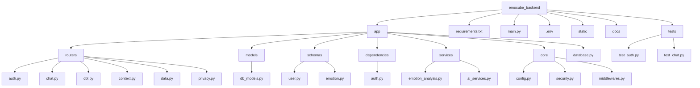

# 情绪立方——基于CBT疗法与AI辅助的主动生态瞬时干预的心理健康APP

#### 快捷使用说明：
[点我前往文档](./docs/README.md)

```mermaid
mindmap
root((情绪立方))
  核心功能
    **🤖拟人化AI对话**
      ▪️情感化表达
        \"情绪缓冲层\"生成
        颜文字/表情包互动
      ▪️成长型记忆
        用户兴趣点追踪
        长期对话脉络
      ▪️多模态交互
        语音思考模拟
        情景式CBT切入
    **🛠️CBT干预工具**
      ▪️认知重组训练场
        思维谬误捕捉
        成功碎片收集
      ▪️行为激活盲盒
        场景化微行动
        校园情境推荐
    **🚨智能EMA守护**
      ▪️多维度感知
        位置情境识别
        生理数据监测
        校园作息匹配
      ▪️即时干预
        焦虑词库触发
        呼吸练习推送
    **📊数据可视化**
      ▪️情绪天气日历
        压力值热力图
        情绪事件标记
      ▪️认知重构进度
        消极思维转化率
        思维进化树状图
      ▪️能量多维罗盘
        生物数据关联
        成长轨迹追踪
  技术支撑
    **🔬情感计算**
      中文RoBERTa微调
      校园流行语理解
    **💬对话生成**
      微调deepseek大模型
      朋辈辅导语料库
    **📍情境感知**
      传感器数据融合
      校园场景识别算法
  隐私安全
    **🔒本地保险箱**
      端到端加密
      敏感数据本地化
    **🛡️匿名化处理**
      碎纸机机制
      差分隐私
    **⚠️防依赖机制**
      使用频率提醒
      健康使用引导
```

# 需求分析

## 一、背景

"每5个人中就有1人在与情绪问题共处"——当我们在校园心理调研中发现这个数据时，一组鲜活的声音浮现出来：  
• 室友小南总在凌晨三点发朋友圈"又是失眠的一夜"  
• 科创队友阿凯在答辩前反复说"我肯定会搞砸的"  
• 考研自习室里此起彼伏的叹气声...  

传统心理服务存在三重困境：

1. **可及性障碍**：高校心理咨询平均等待周期达17.3天（中国心理学会，2022）
2. **病耻感阻碍**：68%受访者因担心被标签化回避专业帮助
3. **连续性缺失**：82%的咨询效果在应激事件中难以维持（JAMA Psychiatry, 2021）

因此，我们团队提出 **"认知立方(CogniCube)"** 理念，将专业CBT疗法拆解为可随时取用的数字工具，结合有温度的AI陪伴，让心理援助像创可贴一样触手可及。

## 二、目标用户画像  

4. **轻中度情绪困扰者**：涵盖焦虑、抑郁、压力大等不同情绪问题的人群，他们迫切需要日常情绪管理工具，以更好地应对生活中的情绪挑战。
5. **心理健康关注者**：这类人群重视自身心理健康，希望通过相关工具预防心理问题，进一步提升心理韧性，保持良好的心理状态。
6. **CBT疗法用户**：正在接受 CBT 疗法的用户，需要辅助工具来更有效地进行治疗，帮助他们更好地理解和应用 CBT 疗法的原理和技巧。

**核心场景：**
- 考试周破防的深夜
- 社团面试前的紧张时刻 
- 人际矛盾后的情绪漩涡

## 三、核心功能亮点

### 1. 拟人化AI对话

**（让AI成为有记忆的树洞）**  

• **情感化表达：**  

  - 当用户说"今天糟透了"，AI不会机械回复"建议深呼吸"，而是说："听起来你经历了一场风暴，要和我拼凑下今天的碎片吗？"  
  - 结合表情包/颜文字增强对话温度：(´•༝•\`) → "这个委屈脸是你现在的状态吗？"  

• **成长型对话逻辑：**  

  - 记忆用户3次以上提到的兴趣点（如"常提的橘猫"），在后续对话中自然引入："记得你喂过的小橘，它现在应该也在晒太阳吧？"  

• **多模态反馈：**  

  - 语音消息配合键盘敲击音效："听到你分享的这件事...（停顿2秒模拟思考）或许我们可以换个角度看..."   

 • **情景式切入CBT疗法**

- **声纹共鸣舱**：  
    "（键盘敲击音效+呼吸频率同步）正在生成情绪缓冲层...3秒后输送认知缓冲垫"
- **情景穿梭门**：  
    "检测到焦虑黑洞！是否切换至『认知重组平行宇宙』？入口密码是你的最近三次笑容记录✨"

### 2. CBT干预工具箱  

**（把心理咨询室装进口袋）**  

• **认知重组训练场：**  

  "当你说'我永远做不好pre'时，其实大脑在玩放大镜游戏呢！我们来找找被忽略的成功碎片吧——"  

• **行为激活盲盒：**  

  根据宿舍环境推荐微行动：  
  🌙深夜场景→"试着给明天的自己写张鼓励便利贴"  
  ☀晨间场景→"打开窗深呼吸三次，和阳光击个掌"  

### 3. 智能EMA守护系统  

**（像贴心室友般的即时关怀）**  

- 检测到凌晨1点后连续滑动焦虑词库，触发轻干预：  "夜猫子警报！需要来段星空呼吸法吗？🌌"  
- 结合校园场景定制：  考试周自动推送"记忆面包"表情包：  "啃完这片面包，知识点都装进脑袋啦！(๑＞ڡ＜)☆"  

APP 具备强大的情境感知能力，通过获取用户的位置信息（如办公室、学校、家中等）、时间信息（如白天、深夜、工作日、周末等）以及生理数据（如心率突增、血压变化等），智能判断用户可能出现的情绪状态。当检测到特定的情境和情绪波动时，会自动触发干预措施。例如，当检测到用户在深夜出现焦虑情绪时，APP 会立即推送呼吸练习的指导音频或“认知解离”的相关音频引导，帮助用户在当下快速调整情绪。

### 4.数据可视化与反馈

**（建造你的情绪博物馆）**

• **情绪天气日历：**

- 用晴/雨/雷电图标标注每日情绪波动："周三的雷雨云持续了4小时，但你在19:23成功召唤了彩虹！🌈"
- 滑动查看"压力值降水分布图"："本周焦虑峰值比上周降低37%，像退潮后的贝壳滩值得探索"

• **认知重构进度条：**

- 可视化消极思维转化率："成功拦截了87次'我做不到'，其中有62次变成了'或许可以试试'"
- 生成思维进化树状图："三个月前扎在'自卑沼泽'的根系，现在已经长出'自我接纳'的新枝桠🌱"

• **多维度能量罗盘：**

- 结合智能手环数据构建动态模型：  
    🧠认知维度："本周专注力像过山车，周三15点的陡坡对应你完成presentation的时刻！"  
    ❤️情感维度："周日晚间的心率波动，原来和妈妈的电话有78%的情绪关联度"

## 四、技术实现

| 模块   | 实现方案                                               | 创新点                                                      | 市面上其他相似应用的不足                                                             |
| ---- | -------------------------------------------------- | -------------------------------------------------------- | ------------------------------------------------------------------------ |
| 情感计算 | 基于中文 RoBERTa 模型，利用校园语料库进行微调，并结合 deepseek 开源模型进行优化。 | 能够精准理解“破防”“emo”等学生流行语，通过深度模型训练提供强大的语言理解能力，准确把握用户情感倾向。    | 部分应用仅为套壳 GPT，单纯依靠 prompt 工程，缺乏对模型的深度开发与优化，无法有效应对复杂多样的语言情境，难以实现个性化的情感理解。  |
| 对话生成 | 对 deepseek 模型进行针对性微调，并运用 prompt 工程优化对话策略。          | 可以提供多种自然、可接受的对话风格，主动发起话题并高度拟人化，让用户感受到真实、亲切的交流体验。         | 多数类似应用中的机器人不支持主动发言，回复内容单一，多为机械重复“我在这里听”“你还有什么想分享的”等话术，无法主动引导对话深入，用户体验较差。 |
| 情境感知 | 综合手机传感器数据（如加速度、陀螺仪等）与校园作息时间表，构建智能分析模型。             | 能够准确识别课堂、食堂、图书馆等典型校园场景，并与时间信息精准匹配，根据不同情境为用户提供即时、精准的心理支持。 | 其他应用往往无法有效整合多种数据来源，难以实时获取准确的情景信息，导致无法在用户需要时及时提供针对性的帮助。                   |
## 五、隐私数据相关的处理

### 本地保险箱

几乎所有的数据都安全存储在本地设备中，并采用先进的加密算法进行加密处理，严格限制访问权限，确保用户数据的保密性和完整性。只有经过授权的操作才能访问这些数据，有效防止数据泄露风险。

### 隐私盾牌

对于部分必要上传的数据，会先经过“碎纸机”匿名化处理，将数据进行碎片化、脱敏化操作，确保上传的数据无法直接或间接识别用户身份。然后采用端到端加密技术进行存储，从数据的源头到存储终端全程加密保护，保障数据在传输和存储过程中的安全性。

### 防依赖机制

当用户与 APP 的对话次数达到一定阈值时，系统会温柔提醒用户合理使用 APP，避免过度依赖。引导用户逐步建立自我调节能力，保持健康的心理状态，确保 APP 作为辅助工具的适度使用。

## 六、未来的发展内容

### 社区支持

计划搭建一个活跃的社群交流平台，为用户提供一个分享相似感受、交流应对经验的空间。在这个平台上，用户可以相互支持、鼓励，共同探索心理健康的奥秘，增强彼此的心理韧性。

### 场外信息扩展

在充分保障用户隐私的前提下，接入第三方的信息资料库，整合更多元、丰富的心理健康资料。这些资料将涵盖不同领域、不同视角的心理健康知识，为用户提供更全面的学习资源，助力他们更好地了解和管理自己的情绪

